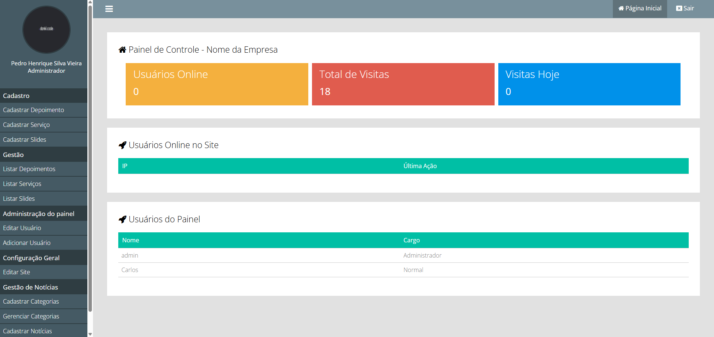

# 🛠 Painel Administrativo PHP (Em Evolução)

<p align="center">
  
  
</p>

---

## 📌 Sobre o Projeto

Este é um **Painel Administrativo completo**, desenvolvido com foco em **organização estrutural, segurança, escalabilidade e material de estudo**.

Mais do que implementar funcionalidades, o objetivo deste projeto é **evoluir continuamente a arquitetura**, aproximando-se progressivamente de um padrão robusto inspirado em MVC e boas práticas modernas.

> Não é apenas sobre fazer funcionar.  
> É sobre construir algo que possa crescer sem virar um caos.

---

# 🚀 Tecnologias Utilizadas


-777BB4?style=for-the-badge&logo=php&logoColor=white)


---

## 🎥 Demonstração em Vídeo

[Assista à demonstração do sistema] https://youtu.be/gL-Ypm0rF5o

## 🎥 Preview


# 🔐 Funcionalidades Implementadas

## Autenticação e Permissões

- Login com sessão  
- Cookies configurados com segurança 
- Controle de permissões por nível de usuário  
- Restrição de acesso para usuários não administradores  
- Proteção contra acesso direto a rotas internas  
- Validações no back-end  

---

## 📰 Gestão de Conteúdo

- Cadastro de notícias  
- Cadastro de categorias  
- Gerenciamento completo de notícias  
- Ordenação dinâmica por categoria  
- Paginação baseada na quantidade real de registros  

---

## ⚙ Administração

- Cadastro e edição de usuários  
- Configuração geral do site  
- Gestão de conteúdos institucionais  
- Ordenação dinâmica de dados  

---

## 📂 Upload com Validação

- Validação de extensões permitidas (.png, .jpg, etc.)  
- Bloqueio de arquivos não autorizados  
- Tratamento antes de salvar no banco  
- Organização estruturada de diretórios
- excluir arquivo da pasta uploads
- gerar id único para cada imagem do usuário para evitar conflitos 

---

## 🌐 Configuração com `.htaccess`

- Bloqueio de acesso a diretórios sensíveis  
- Impede listagem de arquivos  
- Reescrita de URLs
- Proteção de arquivos internos  

---

# 🏗 Estrutura Atual do Projeto

```bash
/
├── ajax/
│
├── classes/
│   ├── Email.php
│   ├── Mysql.php
│   ├── Painel.php
│   ├── Site.php
│   └── Usuario.php
│
├── database/                    # Contém o arquivo SQL para importar no phpMyAdmin e criar toda a estrutura do sistema
│   └── Projeto_01.sql
│
├── pages/                       # Páginas públicas
│   ├── 404.php
│   ├── contato.php
│   ├── home.php
│   ├── noticia_single.php
│   └── noticias.php
│
├── painel/                      # Área administrativa
│   ├── index.php
│   ├── login.php
│   ├── main.php
│   │
│   ├── pages/                  # Módulos administrativos
│   │   ├── home.php
│   │
│   │   ├── adicionar-usuario.php
│   │   ├── editar-usuario.php
│   │
│   │   ├── gerenciar-noticias.php
│   │   ├── cadastrar-noticia.php
│   │   ├── editar-noticia.php
│   │
│   │   ├── gerenciar-categorias.php
│   │   ├── cadastrar-categorias.php
│   │   ├── editar-categoria.php
│   │
│   │   ├── listar-servicos.php
│   │   ├── cadastrar-servico.php
│   │   ├── editar-servico.php
│   │
│   │   ├── listar-depoimentos.php
│   │   ├── cadastrar-depoimento.php
│   │   ├── editar-depoimento.php
│   │
│   │   ├── listar-slides.php
│   │   ├── cadastrar-slides.php
│   │   ├── editar-slide.php
│   │
│   │   ├── editar-site.php
│   │
│   │   └── permissao_negada.php
│   │
│   ├── css/
│   ├── js/
│   └── uploads/
│
├── estilo/
├── fonts/
├── images/
├── js/
│
├── .htaccess
├── config.php
└── index.php
A estrutura será refinada progressivamente para se aproximar de um padrão arquitetural mais próximo de MVC.

🌐 Uso da API do Google Maps
O projeto pode integrar mapas utilizando a API do Google Maps via JavaScript. Exemplo de inclusão:
<script src="https://maps.googleapis.com/maps/api/js?key=SUA_CHAVE_AQUI&v=3.exp"></script>

⚠️ Importante: Não é recomendável subir a chave da API diretamente para o GitHub, pois qualquer pessoa poderia usá-la.
🔒 Boas práticas para o GitHub

Variável de ambiente
Crie um arquivo .env (não adicione ao GitHub):
GOOGLE_MAPS_KEY=SuaChaveAqui

Use a variável no seu código ou substitua no build.
Arquivo de configuração local
Crie config.js ou config.php com a chave, e adicione no .gitignore.
Restringir a chave no Google Cloud
Configure restrição por domínio ou IP para que a chave só funcione no seu site.
Exemplo de uso seguro no JavaScript
const script = document.createElement('script');
script.src = `https://maps.googleapis.com/maps/api/js?key=${process.env.GOOGLE_MAPS_KEY}&v=3.exp`;
document.head.appendChild(script);

Para acessar o painel:

/painel
🖥 Requisitos
PHP 7.4+

MySQL

Apache

XAMPP (recomendado)

⚙ Instalação e Execução
1️⃣ Instalar o XAMPP
Baixe em:

https://www.apachefriends.org/

Ative:

Apache

MySQL

2️⃣ Clonar o Repositório
git clone https://github.com/DevPedroHenrique25/Painel-Admin-PHP
Mover para:

C:\xampp\htdocs\

3️⃣ # 🗄 Banco de Dados
O arquivo de estrutura do banco de dados está disponível em:

database/Projeto_01.sql

## 📥 Como importar
1. Acesse:
http://localhost/phpmyadmin

2. Crie um banco de dados com o nome:
projeto_01

3. Clique em:
Importar

4. Selecione o arquivo:
database/painel_admin.sql

5. Clique em Executar

---

Após isso, o sistema estará pronto para uso.

4️⃣ Configurar Conexão
define('HOST', 'localhost');
define('USER', 'root');
define('PASSWORD', '');
define('DATABASE', 'nome_do_banco');
📧 Configuração de E-mail (Mailtrap)
O sistema utiliza envio de e-mail via SMTP.

Para ambiente local, recomenda-se o uso do Mailtrap.

1️⃣ Criar Conta
https://mailtrap.io/

2️⃣ Configurar no Projeto
define('SMTP_HOST', 'sandbox.smtp.mailtrap.io');
define('SMTP_PORT', 2525);
define('SMTP_USER', 'SEU_USERNAME');
define('SMTP_PASS', 'SUA_SENHA');
define('SMTP_NAME', 'Nome do Sistema');


🌐 Acesso ao Projeto
Frontend:
http://localhost/projeto_01_servidor

Área Administrativa:
http://localhost/projeto_01_servidor/painel

📈 Roadmap de Evolução
🔹 Fase 1 – Estrutura Base (Atual)
CRUD completo

Sistema de autenticação

Controle de permissões

Paginação dinâmica

Upload com validação

Proteção via .htaccess

🔹 Fase 2 – Refatoração Estrutural
Separação clara de camadas

Organização próxima de MVC

Isolamento completo da camada de dados

Redução de acoplamento

# 📚 Aprendizados

Durante o desenvolvimento deste projeto foram aplicados conceitos como:

- Organização orientada a responsabilidades
- Controle de acesso por nível
- Validação server-side
- Estruturação progressiva rumo ao padrão MVC
- Separação parcial entre regra de negócio e apresentação

# 🧩 Desafios Técnicos

- Evitar acesso direto a rotas internas
- Garantir controle de permissões consistente
- Manter organização mesmo sem framework
- Estruturar projeto escalável usando PHP puro


🎯 Objetivo
Construir um sistema que evolua progressivamente, demonstrando:
Maturidade arquitetural
Aplicação de boas práticas
Evolução estrutural consciente
Preparação para escalar

# 🧠 Decisões Arquiteturais
Este projeto foi desenvolvido sem framework propositalmente,
com o objetivo de compreender profundamente:
- Organização manual de rotas
- Estruturação de camadas
- Controle de dependências
- Responsabilidades de classes

Este projeto representa a transição de código funcional para código arquitetado.

🤝 Contribuições
Sugestões de melhoria estrutural, segurança, organização ou arquitetura são extremamente bem-vindas.

Construir é importante.
Evoluir é essencial.
